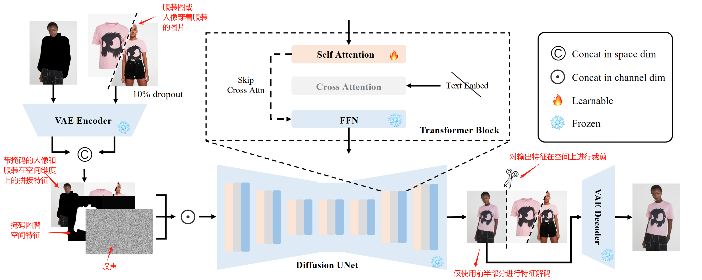

## CatVTON: Concatenation Is All You Need for Virtual Try-On with Diffusion Models (in 2024)

[代码地址](https://github.com/Zheng-Chong/CatVTON/) [demo](https://huggingface.co/spaces/zhengchong/CatVTON/)

论文中提出了一种简单高效的扩散模型（简称CatVTON）应用于虚拟试穿任务，只需要将服装和人物图像的简单拼接作为输入，即可获得高质量的试穿结果。
模型的高效体现在三个方面：
1) **轻量级网络**: 仅使用原始扩散模块，无需额外的网络模块。并且删除了主干中用于文本注入的文本编码器和交叉注意力，使参数减少了 167.02M。 
2) **参数高效训练**: 仅训练 49.57M 参数（自注意力层，仅占骨干网参数的约5.51%）实现了高质量的试穿效果。 
3) **简化推理过程**: CatVTON消除了所有不必要的条件和预处理步骤，包括姿态估计、人体解析和文本输入，只需要虚拟试穿过程的服装参考、目标人物图像和mask掩码。

### 相关工作对比
如上图是不同类型试穿方法的结构比较。
(a) 基于扭曲变换的试穿方法，通常采用两阶段的过程，包括通过提取目标人的姿势（一定数量的关键点），使用变换模型（Warping Module）来扭曲服装，然后使用试穿模型（Try-on Module）将扭曲的服装混合到人身上。这种方法往往会产生不自然的和不合适的服装，同时在处理复杂的姿势方面存在困难。 (b) 基于扩散模型的虚拟试穿方法，额外引入ReferenceNet作为另一种形式的图像编码器，将服装图像编码到多尺度特征中，以补充预先训练的图像编码器的局限性。ReferenceNet和Try-onNet 往往是结构相同的，这样可以实现特征对齐。 (c) CatVTON既不需要通过扭曲服装，也不需要沉重的ReferenceNet进行额外的服装编码; 它只需要服装和人物图像的简单拼接作为输入，获得高质量的试穿结果。

**为什么不需要额外的ReferenceNet？**
ReferenceNet的关键思想是从主干UNet复制权重，并保持相同的网络结构。它自然地与主干 UNet 共享潜在空间，显著促进了特征交互。但是，使用相同的UNet同时处理人和服装，可以更简单的共享潜在空间。

**为什么不需要文本编码器和交叉注意力**
预训练模型已经从大规模数据中学习到很强的先验知识，所以可以不需要额外的文本提示。因此整合文本和图像特征的交叉注意力也不需要了。因此，删除了原始扩散模型中的文本编码器和交叉注意力，使负责全局交互的自注意力是唯一的可训练模块。

**为什么不需要额外的预处理，如姿态估计和人工解析等？**
原始的人像和服装图片中已经存在大部分的信息，并且预训练的扩散模型包含从广泛数据中获得的先验知识。因此可以不需要额外的信息，只需要人、服装图像和二进制掩码来完成虚拟试穿。

### 方法
#### 1 潜在扩散模型(Latent Diffusion Models)
Latent Diffusion Models (LDMs) 主要目的是将图像输入映射到由预先训练的变分自动编码器 (VAE) 定义的低维潜空间中，这样扩散模型可以在**保留生成高质量图像的能力的同时降行训练和推断的计算成本**（因为是基于潜空间进行扩散过程，相较于图片计算量更低）。LDM 的组件主要是去噪 UNet $E_θ(◦, t)$ 和由编码器 $ε$ 和解码器 $D$ 组成的 VAE。给定输入 $x$， 通过最小化以下损失函数训练 LDM:

其中 $t ∈ \{1, ..., T \}$ 表示前向扩散过程的时间步长。在训练阶段，潜空间表示 $z_t$ 来自编码器 $ε$ ，并给 $z_t$ 添加了高斯噪声 $\epsilon \sim \mathcal{N}(0,1)$ ，损失函数就是在计算**添加噪声和噪声预测的平方差**。之后，从分布 $p(z)$ 中提取的潜空间样本，只需使用一次解码器 $D$ 将其翻译回图像域。

#### 2 扩散校正和估计自适应模型(DREAM)
DREAM是一种训练策略，图像超分辨率任务中可以巧妙地寻找最小化失真和保持高图像质量之间的平衡。在训练期间，扩散模型用于预测添加的噪声 $ε_θ$ 。 $ε_θ$ 与原始添加的噪声 $ε$ 相结合以获得 $\bar{ε}$ ，用于计算 $\hat{z}_t$ ：

其中 $λ$ 是调整 $ε_θ$ 强度的参数， $\bar{\alpha}_{t}$ 

$= \prod_{i = 1}^{t} 1 - \beta_{i}$ ，方差调度器 （variance scheduler） $\{\beta_{t} \in (0, 1)\}_{t = 1}^{T}$ 。DREAM 的训练目标如下

#### 3 CatVTON

#### 轻量级网络 (Lightweight Network)
图像本身已经保留了最全面的信息，任何形式的图像编码本质上都是压缩或提取图像包含的信息。图像编码器DINOv2使用大量聚类图像进行自监督预训练，或CLIP使用文本图像对进行了广泛的预训练，以对齐两种模式的语义。但这些方法往往达不到虚拟试穿需要的对齐精度（这些预训练方法无法对服装细节进行表达）。同样可以使用ReferenceNet进行细节对齐，让人和服装特征在扩散过程中对齐，但论文中认为用一个网络也可以有效实现细节对齐。CatVTON 仅保留了两个模块 
1) **VAE**
VAE 编码器 （冻结参数） 负责将输入图像编码为潜空间表示，从而优化计算效率。VAE 解码器（冻结参数）最终将潜空间特征重构为原始像素空间。CatVTON使用同一个图像编码器处理人像和服装图两个输入。这种方法不仅减少了参数量，还确保了输入彼此对齐。

2) **Denoising UNet**
去噪UNet（Denoising UNet）通过结合潜空间中的特征来合成最终的试穿图像。它接受连接的服装和人物特征，以及噪声和掩码作为输入，学习来自这些条件的所有信息。由于不使用额外的文本信息，所以去掉了交叉注意模块和文本编码器。 
最后的网络架构，参数量为89.06M，与其他基于扩散的方法相比显着减少 44% 以上。

#### 参数高效训练 (Parameter-Efficient Training)
潜在扩散模型 (Latent Diffusion Models) 已经在大规模数据集下进行了充分的训练，能够有效的将图像编码为特征。因此，对于虚拟试穿任务时只需要通过微调使模型获得人和服装特征之间的相互作用。论文中通过实验发现仅训练**自注意力层（49.57M参数）**，试穿效果上与训练完整的UNet（815.45M参数）或 transformer blocks（267.24M）没有明显的差异，所以使用更少的训练参数同样可以实现高质量的试穿效果。

训练时，classifier-free guidance的dropout率设置为10% （随机10%的数据不输入服装图像，目的是在不给定充足的条件下，模型也可以获得真实的生成效果）。

#### 简化推理过程 (Simplified Inference)
推理过程只需人物图像、服装参考图和与服饰无关的掩码图（指生成的mask与服装是无关的，一般通过扩大mask区域获得）即可完成。
给定一个目标人物图像 $I_p \in \mathbb{R}^{3 \times H \times W}$ 和与服装无关的二进制掩码 $M \in \mathbb{R}^{H \times W}$ ，一个与服饰无关的人物图像 $I_m$ 通过以下方式获得：

$⊗$ 表示逐元素 (Hadamard, 阿达玛) 乘积。再将与服饰无关的人物图像 $I_m$ 和服装参考(目标服装图或穿着目标服装的人图像) $Ig\in \mathbb{R}^{3 \times H \times W}$ 通过VAE编码器 $ε$ 编码到潜空间中:

$Xm$, $Xg \in \mathbb{R}^{4 \times \frac{H}{8} \times \frac{W}{8}}$ ， $M$ 也通过插值的方式以匹配潜空间的大小，得到特征 $m\in\mathbb{R}^{\frac{H}{8} \times \frac{W}{8}}$。 $m$ 和 $X_{g}$ 沿空间维度连接，形成 $X_{c}\in\mathbb{R}^{8\times\frac{H}{8} \times \frac{W}{8}}$ 。

掩码 $m$ 与相同大小的全零掩码连接，得到 $m_{c}\in\mathbb{R}^{8\times\frac{H}{8} \times \frac{W}{8}}$：

其中 $©$ 表示沿空间维度的连接操作， $O$ 表示全零掩码。 
去噪时， $X_c$ 、 $m_c$  和与  $X_c$ 相同大小的随机噪声 $z_T ∼ N (0, 1)$ 沿通道维度连接并输入到去噪 UNet 以获得预测的 $z_{T - 1}$，这个过程重复 $T$ 次以预测最终的潜在 $z_0$。去噪过程可以写成

其中 $⊙$ 表示沿通道维度的连接操作，通过在空间维度上对 $z_{0}\in \mathbb{R}^{8\times\frac{H}{8}\times\frac{W}{8}}$ 裁剪提取人像部分 $z^{p}_{0}\in \mathbb{R}^{4\times\frac{H}{8}\times\frac{W}{8}}$ 。最后使用VAE解码器 $D$ 将去噪的潜空间表达转换回图像空间。

### 实验
**模型**：StableDiffusion v1.5修复模型。
**数据**：VITON-HD, DressCode, and DeepFashion 三个数据集，所有图像调整到 $1024×768$ 大小。
**参数**: 
1) 对于VitonHD 和 DressCode数据集训练了两个模型, 设置优化器为AdamW，分辨率 $512×384$ ，batchsize大小为128，恒定学习率1e-5训练16,000步。训练时 DREAM 参数 p = 10。

2) 对于多任务，包括分辨率 1024×768 的服装图 (in-shop) 和人物穿着服装 （worn garments），除了batchsize为32，训练48,000步，其他设置和 1) 相同。

### 总结
CatVTON 是一种轻量级且高效的虚拟试穿扩散模型，仅具有49.57M可训练参数。通过空间连接人物和服装图（在隐空间层进行连接）将服装无缝迁移到目标人身上。CatVTON 不需要ReferenceNet 和额外的图像编码器。同时在虚拟试穿时，也不需要额外的处理步骤，如姿态估计、人体解析或文本提示。
