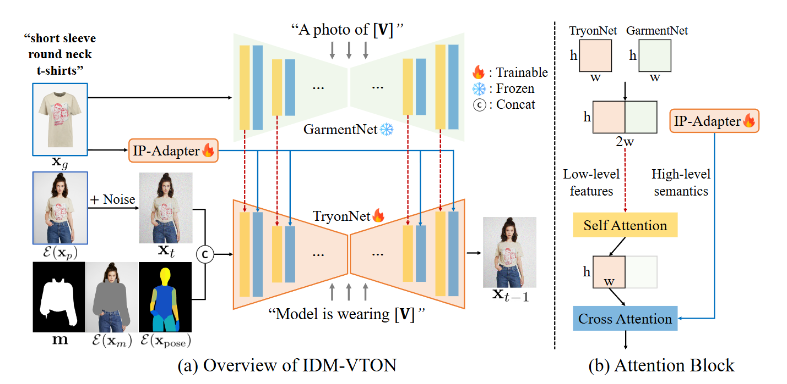
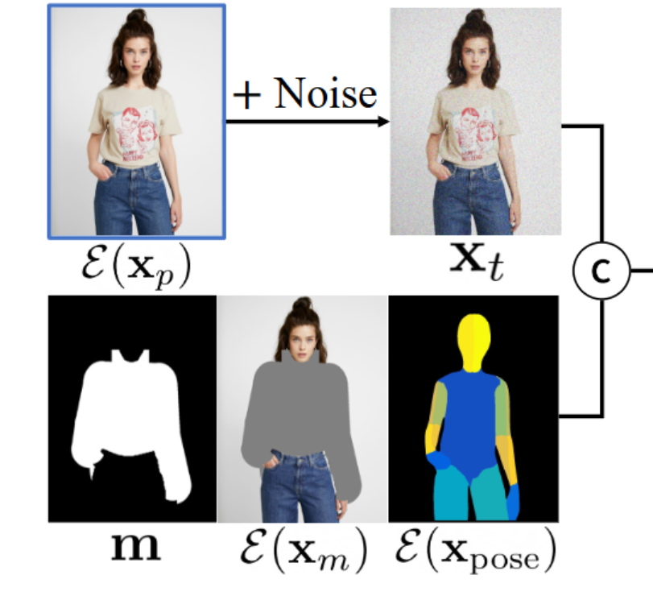
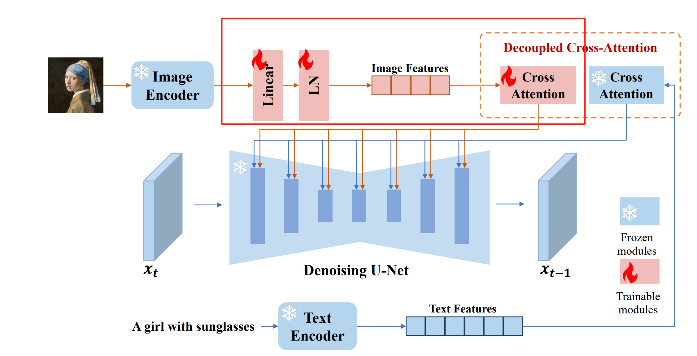
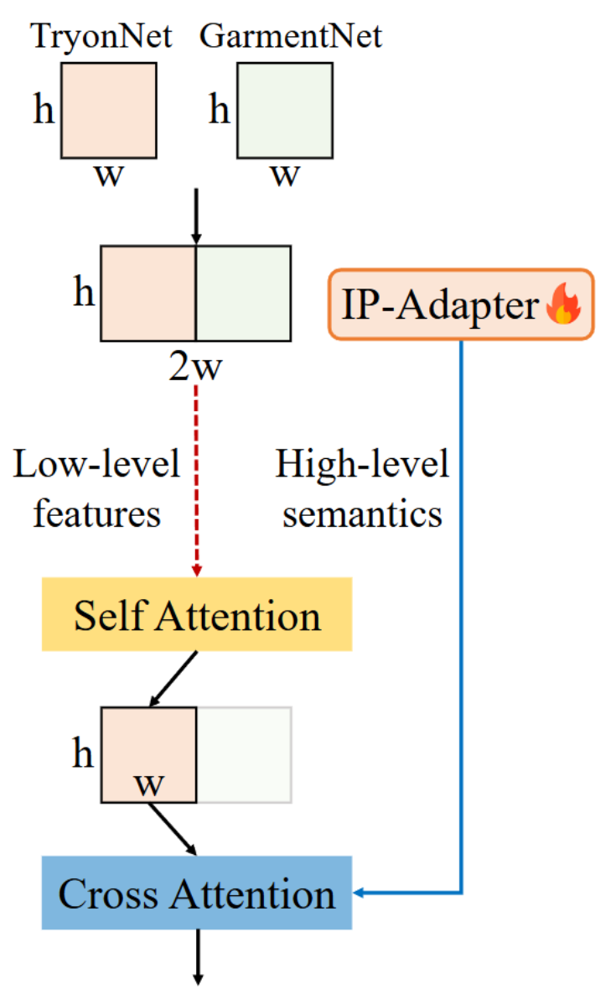
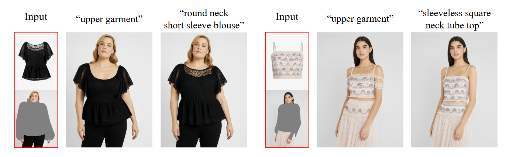
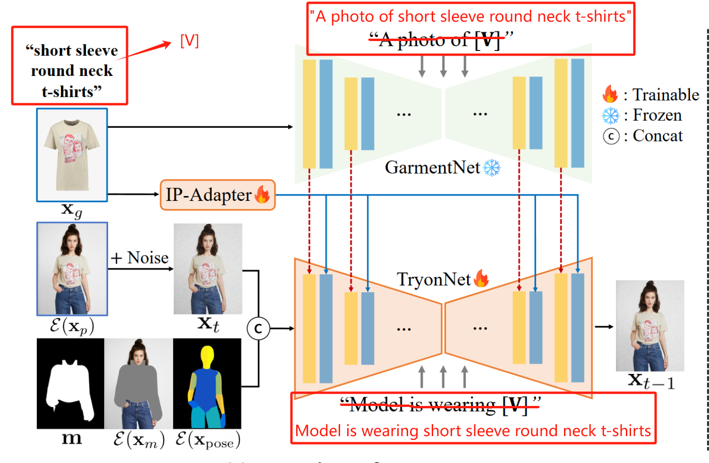
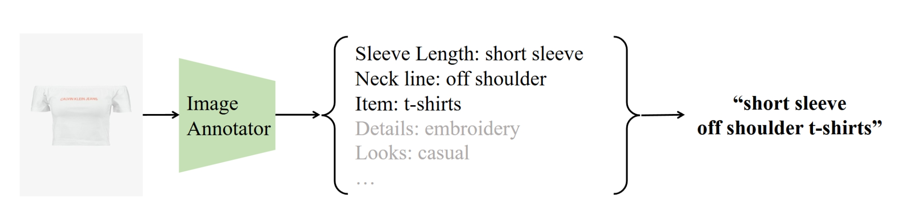

## IDM-VTON: Improving Diffusion Models for Authentic Virtual Try-on in the Wild (in 2024 ECCV) <a name="IDM-VTON"></a>
[项目地址](https://idm-vton.github.io/) [代码地址](https://github.com/yisol/IDM-VTON) [demo](https://huggingface.co/spaces/yisol/IDM-VTON) </br>
论文中提出了一种改进的扩散模型 (Improved Diffusion Models for Virtual Try-ON, 简称IDM–VTON)，使其应用在真实世界场景下虚拟试穿任务。该模型显著提高了服装图像的一致性，可以生成真实的虚拟试穿图像。

具体地，设计一个复杂的注意力模块(attention modules)，可以将服装图像更好的编码到扩散模型，该模块由两个不同的组件组成：</br> 1) 可以对图片中服装的高级语义进行编码的文本提示适配器(image prompt adapter)，其实就是IP-Adapter；</br> 2) GarmentNet, 一个基于UNet的编码器，它提取低层特征以保留细粒度的细节。

[](高级语义信息主要包括服装的款式等，低级语义信息包括)

### 方法
<div align=center>

</div>

$X_p$ 表示一个人的图像，
$X_g$ 表示服装的图像，目标是生成一个图像 $X_t$，可视化来自 $X_p$ 的人穿着图像 $X_g$ 中的服装。
模型由三个部分组成:</br>1) 基于UNet的TryonNet，处理带有姿态信息的人物掩码图像;</br>2) 提取服装高级语义的文本提示适配器(IP-Adapter);</br>3) 基于UNet的特征编码器GarmentNet，提取服装的低级特征。

#### 1 TryonNet 详解

<div align=center>

</div>

TryonNet的输入结合了4个部分，</br> 1) 添加了噪声的人像图的潜空间特征 $ε(X_p)$； </br>
2) 帮助去除人物图像上服装的掩码 $m$； </br>
3) 去除服装后的人像 $X_m$, $X_m = (1- m) ⊙ X_p$, 则 $ε(X_m)$ 表示 $X_m$ 的潜空间特征； </br> 
4) 人像图的姿态信息的的潜空间特征 $ε(X_{pose})$, 姿态信息通过[Densepose](https://arxiv.org/pdf/1802.00434)获得。其中 $ε(X_p)$、 $ε(X_m)$  和 $ε(X_{pose})$ 均包含4个通道（由3种图像分别经过VAE编码层获得）， $m$ 包含1个通道（直接将宽和高调整到和其他3种潜空间特征一致）。将以上4种潜空间特征进行通道融合，输入被扩展到13个通道。TryonNet 使用Stable Diffusion XL (SDXL) 修复模型，原始SDXL inpainting model 输入通道是9，因为额外引入了姿态信息变为13，需要使用一个卷积层修改特征通道（卷积层初始化为0）代码如下:

```python
unet.encoder_hid_proj = image_proj_model

conv_new = torch.nn.Conv2d(
    in_channels=4+4+1+4,
    out_channels=unet.conv_in.out_channels,
    kernel_size=3,
    padding=1,
)
torch.nn.init.kaiming_normal_(conv_new.weight)  
conv_new.weight.data = conv_new.weight.data * 0.  # 初始化为0

conv_new.weight.data[:, :9] = unet.conv_in.weight.data  
conv_new.bias.data = unet.conv_in.bias.data  

unet.conv_in = conv_new  # replace conv layer in unet
unet.config['in_channels'] = 13  # update config
unet.config.in_channels = 13  # update config
#customize unet end
```
#### 2 IP-Adapter 详解
使用IP-Adapter对服装图像进行编码，使用冻结参数的CLIP图像编码器（即 OpenCLIP ViT-H/14）来提取特征。IP-Adapter 是可训练的，对使用预训练参数初始化的IP-Adapter进行微调训练，包括特征投影层（feature projection layers）和交叉注意层（cross-attention layers）。 如下图来自原版IP-Adapter论文图片，微调部分为红框所示。

<div align=center>

</div>

#### 3 GarmentNet 详解
添加这个网络的目的是，虽然IP-Adapter已经引入了来自服装图像的控制，但当服装具有复杂的图案或印花时，IP-Adapter在保留服装的细粒度细节方面存在不足。这是因为 CLIP 图像编码器缺乏提取服装的低级特征（**CLIP训练的文本图像对比较广泛，对服装细节无法详细的描述**）。

<div align=center>

</div>

给定服装图像 
$X_g$ 的潜空间表达，使用**冻结参数**的预训练UNet编码器来获得中间表示， 即 **GarmentNet是基于冻结参数的SDXL的UNet网络** ，其含有丰富的可以生成图片的先验知识（因为在大规模数据级下训练过）。并与来自TryonNet的中间表达进行连接（上图中 $h * w$ 的红框与 $h * w$ 的绿框拼接成 $h * 2w$ 的特征）。然后计算连接特征的自注意力(Self Attention)，只传递来自TryonNet的前半部分特征（上图中 $h * w$ 的红框），将其与IP-Adapter结果特征进行交叉注意计算。可以理解为来自两个UNet网络的低层次特征 (Low-level features) 先通过自注意力进行特征融合，再和来自IP-Adapter的高级语义（High-level semantics）通过交叉注意力进行特征融合。

#### 4 详细的关于服装的文本标题
之前的方法使用类似“上衣”这样的过于简单的文本标题表示所有服饰。为了充分利用文本到图像扩散模型的丰富生成先验，需要提供一个更全面的标题来描述服装的细节，如形状或纹理等。
<!-- {:height="80%" width="80%"} -->

<div align=center>

</div>

如上图，首先有一个关于服饰图片的详细描述，"short sleeve round neck t-shirts" 即短袖圆领t恤，GarmentNet输入的是服饰图像，那传递给GarmentNet的文本提示词可以写成"A photo of short sleeve round neck t-shirts"， 即“一张短袖圆领t恤的图片”。TryonNet输入的是人物相关的图像，那传递给TryonNet的文本提示词可以写成"Model is wearing short sleeve round neck t-shirts"，即“模特穿着短袖圆领t恤”。

```
替换公式
[V] = short sleeve round neck t-shirts
A photo of [V] = A photo of short sleeve round neck t-shirts
Model is wearing [V] = Model is wearing short sleeve round neck t-shirts

代码：
result["caption"] = "model is wearing " + cloth_annotation
result["caption_cloth"] = "a photo of " + cloth_annotation
```
替换公式和代码如上实现。其中[V]，即 cloth_annotation 通过图像注释器（image annotator，对图片中的特定属性进行分类识别）获得。
更详细的描述有助于模型使用自然语言对服装的高级语义进行编码，对基于图像信息进行补充。

### 实验

**模型**：冻结GarmentNet（SDXL的UNet）参数，微调TryonNet (SDXL inpainting的UNet) 和 IP-Adapter 相关参数。</br>
**数据**：使用VITON-HD训练数据集进行训练（11647对的人像和服饰图），训练图片分辨率大小
$1024*768$（掩码图和densepose图也需要调整到这样的大小）。</br>
**参数**：Adam优化器，  batchsize大小为24，学习率为 1e-5 130 个 epoch。对于定制模型，降低学习率为1e-6，进行了100步的微调。</br>
**损失函数**: MSE，预测噪声。
### 如何构建一个新的训练数据集
文中使用 VITON-HD 作为训练数据集，需要构建一个类似的数据集进行训练。</br> 1) 首先需要收集图像对（image 和 cloth），包括一张人像图和一张服饰图，人像图中的穿着的衣物需要与服饰图中一致。</br>
2) 使用原人像图计算获得image-densepose，参考 [pre-processing steps](https://github.com/sangyun884/HR-VITON/issues/45) 第三步。</br>
3) 使用原人像图计算获得agnostic-mask，参考 [pre-processing steps](https://github.com/sangyun884/HR-VITON/issues/45) 第六步。如果需要裤子相关的数据集，生成mask时需要设置识别区域为"lower_body", 可以参考 [get_mask.py](https://github.com/luxiaolili/IDM-VTON-train/blob/main/get_mask.py)，修改如下部分。
```python
mask, mask_gray = get_mask_location('hd', "lower_body", model_parse, keypoints) # 改为lower_body
```
</br>4) 获得详细的服饰描述标签 

<div align=center>

</div>

论文中是基于 [omnicommerce.ai](https://omnicommerce.ai/) 网站实现对服饰图片打标。具体的如下图可以对多种描述类别进行精准识别，文中结合了3种详细描述：</br>
1）Sleeve Length 表示袖长，如长袖、短袖、无袖；</br>
2）Neck Line 可以理解为领型，如V型领，圆领等；</br>
3）Item 表示为具体款式，如t袖、卫衣等。</br> 结合起来就是**袖长+领型+款式**这样的文本描述。通过下面的代码也可以看到具体的实现。
``` python 
annotation_list = [ # 
    # "colors",
    # "textures",
    "sleeveLength",
    "neckLine",
    "item",
]

self.annotation_pair = {}
for k, v in data1.items():
    for elem in v:
        annotation_str = ""
        for template in annotation_list: # 遍历 annotation_list，依次提取每一项的分类结果，对字符串进行连接获得最终描述
            for tag in elem["tag_info"]:
                if (
                    tag["tag_name"] == template
                    and tag["tag_category"] is not None
                ):
                    annotation_str += tag["tag_category"]
                    annotation_str += " "
        self.annotation_pair[elem["file_name"]] = annotation_str
```

-----

