## Leffa: Learning Flow Fields in Attention for Controllable Person Image Generation</a>
[论文地址](https://arxiv.org/abs/2412.08486/) [代码地址](https://github.com/franciszzj/Leffa) [demo](https://huggingface.co/spaces/franciszzj/Leffa)  

论文中提出了通过学习注意力中的流场（Leffa），引导目标查询 （target query）在训练期间关注注意力层中的正确参考键 (reference key)，解决在可控的人像生成任务中，对参考图像中的相应区域的关注不足带来的失真问题。具体来说，通过对扩散模型中注意力图计算正则化损失来实现的。Leffa 在控制外观（虚拟试穿）和姿势（姿势转移）方面实现了最先进的性能，可以在保持高质量图像质量的同时显着降低细粒度的细节失真。

论文贡献如下：  (1) 提出了 Leffa，这是一种正则化损失，引导注意力层中的目标查询专注于正确的参考键，无需额外的参数和推理成本即可减轻细节失真。  (2) 提出的方法可以应用到虚拟试穿和姿态迁移两种可控的人像生成任务中。

### 准备工作
#### 扩散模型
Stable Diffusion 是一个潜在的扩散模型(LDM)，由变分自编码器(VAE) 、UNet  $εθ(·)$ 和文本编码器组成。VAE 包括一个编码器 $E (·)$ 和一个解码器 $D(·)$ ，它**将像素空间中的输入图像编码为潜在空间以降低计算成本**。在训练期间，首先使用 VAE 的编码器 $E (·)$ 将给定图像编码为潜在特征 $z_0$ 。在一次采样扩散时间步长 $t \in \{1, · · · , T\}$ ，基于噪声调度器将高斯噪声 $ε ∼ N (0, 1)$ 添加到潜在特征 $z_0$，得到噪声潜在特征 $z_t$ 。 然后，UNet $ε_θ (·)$ 在条件特征 $c$ 的控制下去除潜在特征 $z_t$ 的噪声。训练损失可以表述为：

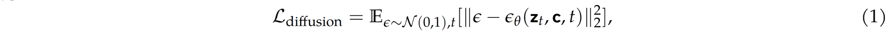

其中 $c$ 可以是文本编码器预测的语言特征或从参考图像派生的视觉特征。

#### 任务定义和符号

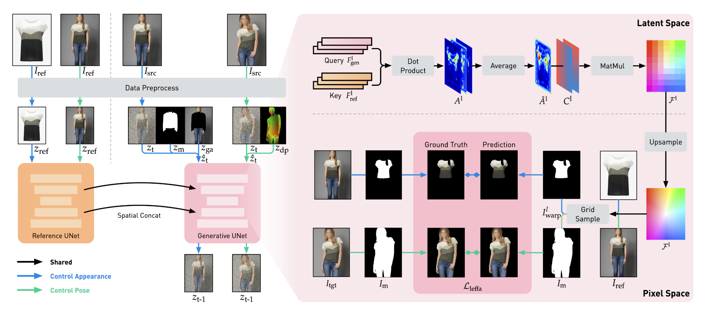

给定一个源人物图像 $I_{src}$ $\in$ $R^{H×W×3}$ 和一个参考图像 $I_{ref}$ $\in$ $R^{H×W×3}$ ，可控人物图像生成旨在生成目标人物图像 $I_{tgt}$ $\in$ $R^{H×W×3}$ ，其中 $H$ 和 $W$ 表示图像的高度和宽度。具体地，在虚拟试穿中， $I_{tgt}$ 表示服装图像 $I_{ref}$ 穿着在 $I_{src}$ 的人身上；而在姿势转移中， $I_{tgt}$ 表示 $I_{ref}$ 中的人采用 $I_{src}$ 中的姿势。在训练期间， $I_{src}$ 和 $I_{tgt}$ 是相同的图像。每个任务的数据预处理定义如下：  (1) 对于**虚拟试穿任务**，首先从 $I_{src}$ 中提取服装掩码 $I_m$ $\in \{0,1\}^{H×W×1}$, 并构建一个与服装无关的图片 $I_{ga}$ $\in$ $R^{H×W×3}$ = $I_{src} ∗ (1 − I_m)$ 。 训练时，通过 VAE 编码器  $E(·)$ 对 $I_{src}$ 和 $I_{ga}$ 进行编码，得到 $z_0$ 和 $z_{ga}$，并将 $I_m$ 调整大小后得到潜在空间 $z_m$。根据产生 $z_t$ 在采样时间步长 $t$ 时刻将噪声添加到 $z_0$ 中，并将其与 $z_{ga}$ 和 $z_m$ 连接起来以构建 $\hat {z_t}$。   (2) 对于**姿态迁移任务**，首先从 $I_{src}$ 中提取 DensePose 图像  $I_{dp} \in R^{H×W×3}$。训练时，使用 VAE 编码器 $E (·)$ 对 $I_{src}$ 进行编码，获得 $z_0$，并将 $I_{dp}$ 调整为 $z_{dp}$ 的潜在分辨率大小。在采样时间步 $t$ 时刻向 $z_0$ 添加噪声以产生 $z_t$，将其与 $z_{dp}$ 连接起来以构建 $\hat z_t$。

对于这两个任务中的参考图像 $I_{ref}$，将其编码为潜在特征 $z_{ref}$，并将其用作公式（1）中定义的扩散损失中的条件特征（公式中的 $c$ ）。如下图中红框所示，通过一个 VAE 编码器对各个图像进行编码，并对部分特征进行连接操作。

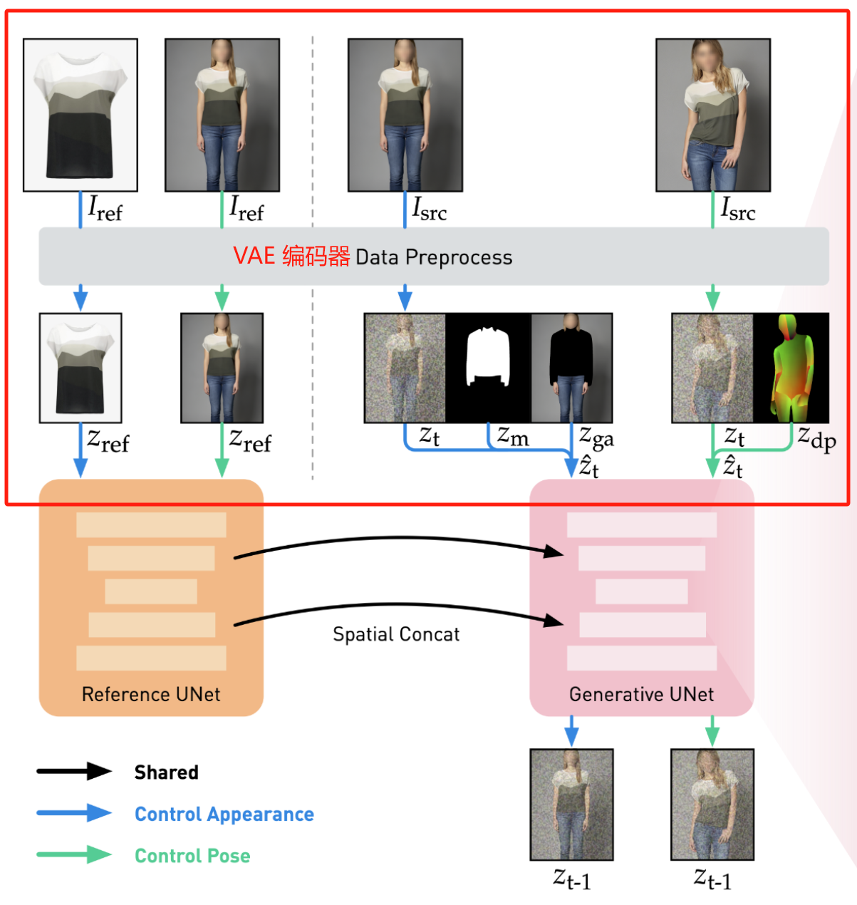

### 方法
为了利用基于扩散模型的方法来保留细粒度的细节，同时保持较高的整体图像质量。提出了 Leffa 损失，通过学习注意力机制中的流场来缓解细节失真。构建了一个统一的基于扩散模型的基线可以同时适用于虚拟试穿和姿势迁移两个任务。

#### 1 基于扩散的基线 （Diffusion-based Baseline）
对Stable Diffusion （SD）进行如下两步修改，  (1) 首先，复制预训练的 SD UNet $ε_θ (·)$ 网络以创建两个独立的 UNet：i) 一个生成式 UNet $ε_{θ_{gen}} (·)$ 用于处理来自源图像 $I_{src}$ 的 $\hat {z_t}$ 。ii) 一个参考 UNet $ε_{θ_{ref}} (·)$ 用于处理参考图像 $I_{ref}$ 中的 $z_{ref}$。删除了两个 UNet 中的用于文本交互的文本编码器和交叉注意力层，只对图像进行条件处理。并且**两个 UNet 是完全可以训练的**。  (2) 对于第 $l$ 层注意力层，将输入到生成式 UNet $ε_{θ_{gen}} (·)$ 中的生成特征定义为 $F^l_{gen} \in \mathbb{R}^{n^l \times {d^l}}$，参考UNet $ε_{θ_{ref}}(·)$ 中的参考特征为  $F^l_{ref} \in \mathbb{R}^{n^l \times {d^l}}$，其中 $n^l = h^l \times w^l$， $h^l$ 和 $w^l$ 是空间维度， $d^l$ 是特征维数。将 $F^l_{ref}$ 与 $F^l_{gen}$ 沿空间维度连接起来，产生连接的特征 $F^l_{cat} \in  \mathbb{R} ^ {2n^l \times d^l }$，并将其输入到生成式UNet的self-attention (自注意力层) 中。只保留与 $F^l_{gen}$ 对应的前半部分输出以供后续处理。这个过程在所有自注意力层中重复。

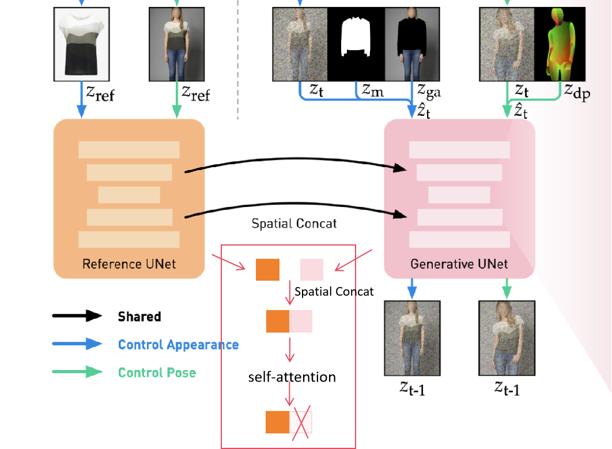

如上图红框内补充了这部分操作的图例过程，通过连接来自两个 UNet 网络的特征，输入到自注意力进行特征交互，只保留前半部分输出结果。

#### Leffa 学习注意力中的流场 (Learning Flow Fields in Attention)
当注意力层中的目标查询 (target query) 无法正确关注参考键 (reference key) 的相应区域时，就会出现细节失真。为了解决这个问题，提出了 Leffa 损失，它通过学习注意力中的流场来明确引导目标查询在空间上关注参考键的正确区域。

具体地，对于生成式UNet $ε_{θ_{gen}} (·)$ 的第 $l$ 层注意力层，使用 $F^l_{gen}$ 作为查询值 $Q$， $F^l_{ref}$ 作为键值 $K$ 来计算注意力图（attention map） $A^l$ ，公式表示的点积注意力如下:

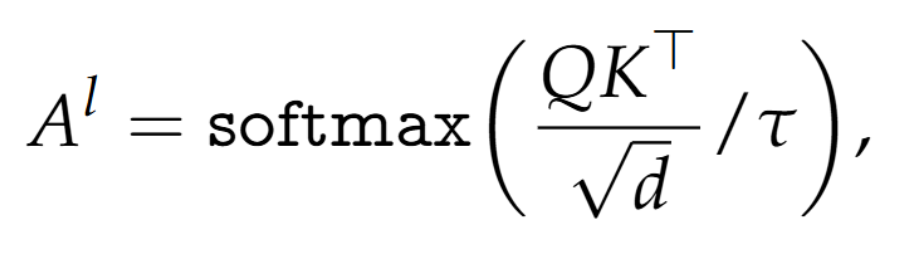

其中 $τ$ 是温度系数， $d$ 是查询 $Q$ 的 token 大小。以上公式对应如下图中红框内部分，对于每一层（图中展示了3层）注意力的 $Query$ 和 $Key$ 点积 (Dot Product，两个向量乘法，向量1乘以向量2的转置)，获得每一层的注意力图。

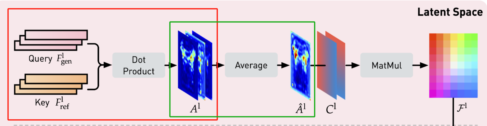

对于每个注意力图 $A^l$，为了确保不同头部的注意力图集中在正确的区域。在 head 维度上平均 $A^l$，得到 $\hat {A^l} \in \mathbb{R}^{n^l \times {n^l}}$ 。操作对应上图绿框部分，得到了一张融合的注意力图。

接下来，将 $\hat {A^l}$ 转换为表示 $I_{src}$ 和 $I_{ref}$ 之间空间对应关系的流场，为此，构建了一个归一化坐标图 $C^l \in \mathbb{R} ^ {n^l × 2}$ ，并重塑为 $\mathbb{R}^{h^l × w^l ×2}$ （ $n^l = h^l × w^l$ ） 。 左上角坐标 $(0, 0)$ 值设置为 $[-1, -1]$ 的值，右下角坐标 $(h − 1, w − 1)$ 的值为 $[1, 1]$。然后，将注意力图 $\hat {A^l}$ 与坐标映射图 $C^l$ 相乘，得到流场 $\mathcal{F} ^ l \in \mathbb{R} ^{n^l ×2}$，公式为 

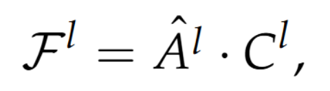

用来表明每个目标查询token  (target query token)  关注的参考特征 $F^l_{ref}$ 上区域的坐标。获得流场 $\mathcal{F}$ 操作如下图中红色框所示。

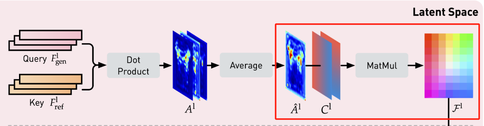

考虑到基于潜在扩散模型，注意力图的分辨率明显低于原始输入图像。为了提供准确的像素级训练监督标签，使用双线性插值将第 $l$ 注意力层中的流场进行上采样 $\mathcal{F} ^ l \in \mathbb{R} ^{n^l ×2}$ 中的流场上采样到原始图像分辨率，得到上采样流场 $\mathcal{F} ^ l_{up} \in \mathbb{R} ^{H \times W \times 2}$。然后使用这个上采样流场 $\mathcal{F} ^ l$ 来扭曲参考图像 $I_{ref}$，产生扭曲的图像 $I^l_{warp} \in  \mathbb{R}^{H \times W \times 3}$。扭曲操作过程如下图红色线圈出部分所示，红线内展示了虚拟试衣部分，其中 **Grid Sample** 用来在输入特征映射上生成一系列的网格点，然后以这些网格点作为基准来采样出相应的图像区域。
 

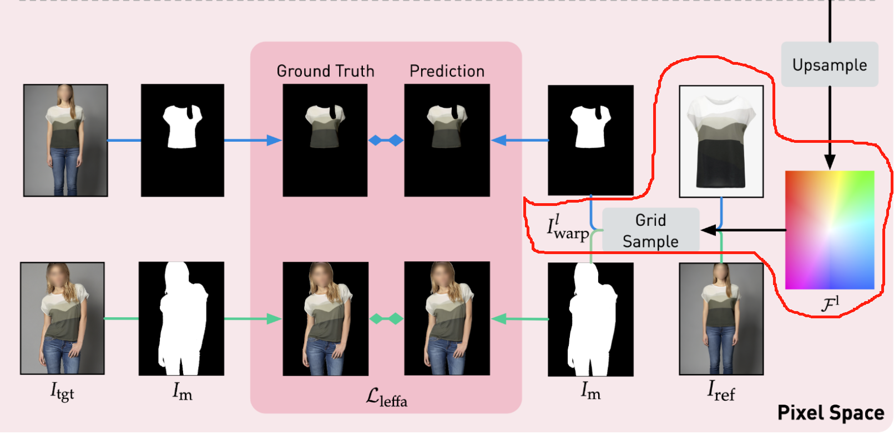

最后，计算 $I^l_{warp}$ 和目标图像 $I_{tgt}$ 的相应区域之间的 $L2$ 损失，定义 Leffa 损失公式：

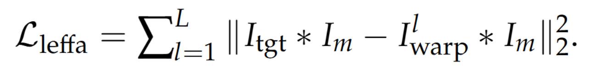

这种损失在没有额外输入或参数的情况下监督注意力图，确保每个目标查询 token 关注正确的参考区域并保留生成图像的细粒度细节一致性。计算 $Leffa$ loss 部分如下图红框内所示。

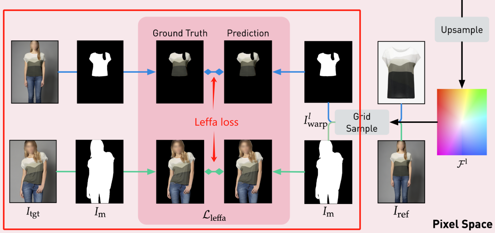

#### 使用 Leffa 损失进行模型训练
基于扩散的基线中的使用 Leffa 损失可以引导目标查询关注正确的参考键，从而减轻细粒度的细节失真。采用 Leffa 损失时使**用渐进式训练**，即 Leffa 损失仅应用于最终的微调阶段，以避免早期的性能下降。模型最初以低分辨率进行训练 （例如，256，512）。然后在最后阶段以更高的分辨率（例如，1024），使用组合损失进行微调，

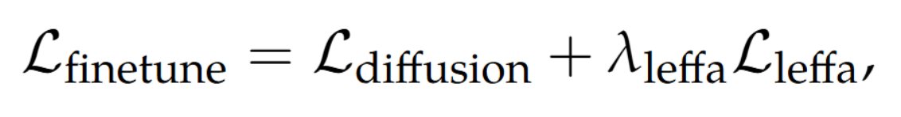

其中 $λ_{leffa}$ 是 $L_{leffa}$ 的损失权重。对于 Leffa 损失的最佳模型性能，还需要考虑如下:

**注意层选择**: 基于 ldm (Latent Diffusion Model) 的方法在潜在空间中对目标图像和参考图像进行特征交互，得到的注意图往往分辨率相对较低。对于低分辨率注意力图，希望准确扭曲参考图像 $I_{ref}$ 是不现实的。因此，设置了一个分辨率阈值 $θ_{resolution} = h/H$（例如 1/32），表示注意力图大小与原始图像大小的比率。只有分辨率大于 $θ$ 的注意力层才会参与 $L_{leffa}$ 的计算。

**时间步长选择**: 
当时间步长 $t$ 很大时，图像会添加大量噪声，由于噪声过大，使得目标和参考之间的准确特征交互将变得困难，这将阻碍关注相应区域的正确语义。 $Leffa$ 损失不适用于大时间步长。因此，设置了一个时间步长阈值 $θ_{timestep}$（例如，当 T = 1000 时为 500），在训练期间，仅当训练时间补偿小于 $θ_{timestep}$ 计算 $L_{leffa}$。

**Temperature 参数选择**
不同的 Temperature 调整 softmax 生成的注意力图的平滑度。较大的 Temperature 会导致更平滑的注意力图，允许目标查询标记关注更广泛的参考特征 $F^{l}_{ref}$，这有助于模型更容易学习正确的参考区域并增加对错误的容忍度。因此使用相对较大的温度 $τ$（即 2.0）。

以上结论是论文是基于实验获得的，实验对比结果如下图, 对于每个参数实验最好的结果用红色框标记出来，FID 值越小生成效果表现越好。

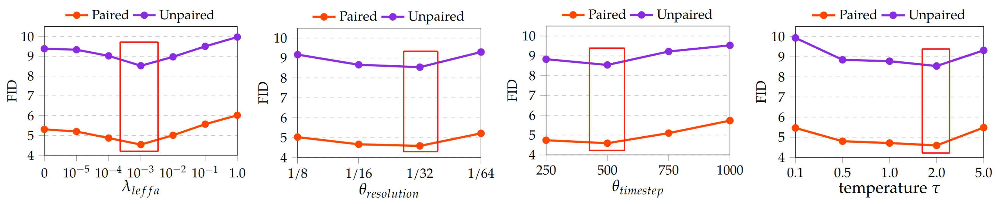

### 实验
**模型**：Stable Diffusion 1.5。 
**数据集**: 对于虚拟试穿，使用VITON-HD和DressCode数据集；对于姿势转移，使用DeepFashion数据集。 
**参数**: 对于虚拟试穿，模型首先在 $512 × 384$ 分辨率下训练 10k 步，batchsize大小为256，然后在 $1024 × 768$ 分辨率下训练 36k 步，batchsize大小为 64。最后对结合 $L_{leffa}$ 进行微调 10k 步。对于姿势转移， $256 × 176$ 分辨率下训练 80k 步，batchsize大小为256，然后增加到 $512 × 352$ 分辨率下训练80k步。最后，使用 $L_{leffa}$ 微调 24k 步。其他设置，AdamW 优化器，学习率为 10−5，应用于所有训练阶段。 $L_{leffa}$ 的超参数设置如下： $λ_{leffa}$ = 10−3， $θ{resolution}$ = 1/32， $θ_{timestep}$ = 500 和 $τ$ = 2.0。

### 总结
论文中提出一种正则化损失、即学习注意力中的流场（Leffa），以增强可控的人物图像生成。该方法不仅保留了较高的整体图像质量，而且减轻了细粒度的细节失真。
